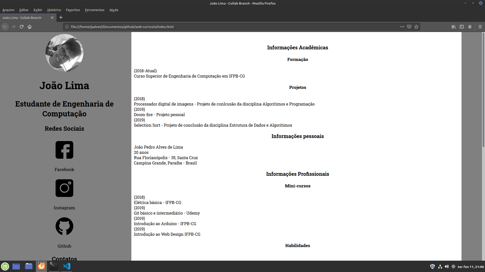

# Web Curriculo

## Repositório criado com a finalidade de fazer a prova pratica para o processo seletivo collab branch

### Como usar

1. Clonar o repositório no seu computador

```shell
git clone https://github.com/jpalvesl/web-curriculo.git
```

2. Abrir o arquivo index.html    
Logo você poderá visualizar a seguinte página

